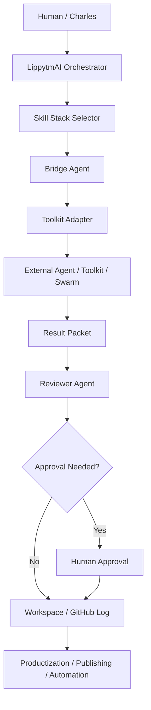

# Agent Interoperability Bridge Operating System

## Purpose

Build AI agents that can and will work with other AI agent toolkits, AI frameworks, swarms, automation platforms, repositories, APIs, and business systems.

This operating system is for **AI Agentic Super Synthetic Intelligence Engines AgentsBots Swarms** that need to cooperate with ChatGPT Business, Claude, GitHub, Zo Computer, Zapier, Canva, MCP servers, no-code tools, developer frameworks, and future AI agent platforms.

## Core principle

Interoperability must be structured, permissioned, logged, and reversible.

The goal is not to connect everything recklessly. The goal is to build bridge agents that can cooperate with many systems while preserving business purpose, safety, privacy, and audit trails.

## Recommended architecture



## Agent roles

### 1. Orchestrator Agent

Purpose:

- chooses the correct skill stack
- decides which external toolkit or swarm should be involved
- creates task packets
- routes outputs to the correct reviewer

Primary skills:

- `Skills/lippytmai-skill-orchestrator/SKILL.md`
- `Skills/agent-interoperability-bridge/SKILL.md`

### 2. Bridge Agent

Purpose:

- converts LippytmAI goals into external-toolkit instructions
- keeps context tight and structured
- prevents unnecessary data sharing
- returns normalized result packets

Primary skills:

- `Skills/agent-interoperability-bridge/SKILL.md`
- `Skills/toolkit-adapter-factory/SKILL.md`

### 3. Adapter Agent

Purpose:

- creates platform-specific adapter specs
- defines input and output schemas
- defines test payloads
- documents authentication and logging needs

Primary skills:

- `Skills/toolkit-adapter-factory/SKILL.md`
- `Skills/agentic-swarm-governance/SKILL.md`

### 4. Reviewer Agent

Purpose:

- checks output quality
- checks safety, privacy, affiliate/funding disclaimers, and public-claim risk
- decides whether the output can be used directly or requires approval

Primary skills:

- `Skills/agentic-red-team-safety-review/SKILL.md`
- `Skills/swarm-observability-evaluation/SKILL.md`

### 5. Productization Agent

Purpose:

- turns repeated bridges into products, services, templates, lead magnets, or SaaS/free-tool concepts

Primary skills:

- `Skills/ai-agent-productization/SKILL.md`
- `Skills/agentic-product-design-lab/SKILL.md`

## Toolkit categories to support

### Chat and reasoning platforms

- ChatGPT Business
- Claude
- Zo Computer
- future assistant platforms

Use cases:

- prompt refinement
- long-context review
- campaign expansion
- eBook drafting
- code planning
- safety review

### GitHub and developer systems

- GitHub repositories
- GitHub Issues
- GitHub Actions
- code review tools
- local workspace scripts

Use cases:

- source-of-truth docs
- issue-driven tasks
- code changes
- pull request reviews
- repository audits

### Automation platforms

- Zapier
- webhook systems
- CRM/spreadsheet workflows
- email/SMS notifications

Use cases:

- lead routing
- campaign logging
- follow-up reminders
- content repurposing queues

### Creative platforms

- Canva
- video generation tools
- image generation tools
- social content workflows

Use cases:

- campaign visuals
- eBook covers
- short-form video prompts
- sales decks
- branded lead magnets

### Agent frameworks and swarms

Examples to evaluate over time:

- LangGraph-style workflow agents
- CrewAI-style role-based crews
- AutoGen-style multi-agent conversation systems
- OpenAI/Anthropic/Google agent SDK patterns
- MCP-enabled tool servers
- custom Zo agents and automations

Use cases:

- multi-agent task execution
- tool calling
- research pipelines
- coding pipelines
- self-healing operations

## Standard task packet

Use this when giving work to another agent/toolkit:

```json
{
  "task_id": "lippytmai-YYYYMMDD-short-name",
  "source": "lippytmai",
  "target_toolkit": "name-of-agent-or-platform",
  "mission": "one-sentence mission",
  "task_type": "research|draft|code|review|automation|design|publish-proposal",
  "business_context": "LippytmAI / Business of Businesses / GetBizFunds / AI Business Funding eBook / Affiliate Platform",
  "inputs": {},
  "constraints": [
    "No guaranteed income claims",
    "No funding approval guarantees",
    "Draft before publishing",
    "Log artifacts to GitHub or workspace"
  ],
  "approval_required": true,
  "logging_target": "Records/Workflows or GitHub issue path",
  "return_format": "markdown summary plus artifact paths"
}
```

## Standard result packet

Use this when receiving work back from another agent/toolkit:

```json
{
  "task_id": "same-task-id",
  "status": "success|needs_review|blocked|failed",
  "summary": "short result summary",
  "artifacts": [
    "workspace file paths, GitHub paths, public URLs, or asset names"
  ],
  "risks": [
    "financial claim risk, data risk, publishing risk, security risk"
  ],
  "recommended_next_step": "next safe action",
  "approval_needed": true
}
```

## Safety model

### Safe autonomous bridge actions

- create adapter specifications
- create test payloads
- create GitHub documentation
- create draft prompts
- create draft Zapier workflow maps
- create internal checklists
- analyze public docs or local repo files

### Approval-required bridge actions

- sending external messages
- activating live Zaps
- changing production lead forms
- connecting payment systems
- publishing public financial/funding claims
- changing secrets or credentials
- allowing external systems to write into core repositories
- running destructive scripts

## First implementation sequence

### Phase 1 — Documentation bridge

Create adapter templates for:

1. ChatGPT Business creative output → GitHub docs
2. GitHub issue → Zo task/workflow execution
3. GetBizFunds lead → Zapier → GitHub issue → follow-up queue
4. Canva prompt → campaign asset → GitHub campaign record

### Phase 2 — Structured task packets

Create reusable JSON and markdown task packet templates.

### Phase 3 — Public command page

Publish an Agent Interoperability Bridge page on Zo Space explaining the system.

### Phase 4 — Productization

Turn the bridge into:

- consulting service
- business automation template kit
- AI agent interoperability eBook section
- lead magnet checklist
- future SaaS/free-tool concept

## Revenue paths

- AI automation consulting
- GitHub + Zapier workflow setup services
- business funding lead routing automation
- affiliate recommendations for AI/business tools
- paid templates
- eBooks and training programs
- custom AgentBot/swarm setup packages

## Next safe build step

Create public page, template files, and GitHub mirror for the first Agent Interoperability Bridge system.
