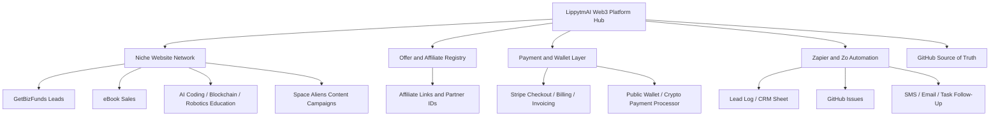

# Web3 Affiliate Hosting and Payment Operating System

## Purpose

Design the foundation for building **more than one hosted Web3 website platform** that can make money through affiliate marketing, business funding leads, eBooks, education products, advertising, payment systems, and crypto-wallet-connected workflows.

This operating system is for LippytmAI, Business of Businesses, GetBizFunds, AI Business Funding eBook funnels, AI coding education, robotics/blockchain education, Space Aliens entertainment campaigns, and future AI Agentic Super Synthetic Intelligence Engines AgentsBots Swarms.

## Strategic direction

The platform should become a **multi-site affiliate and commerce network**.

Each site should work in two ways:

1. **Separately** — each website has its own audience, offers, content, CTAs, and revenue logic.
2. **Together** — every website feeds the broader LippytmAI / Business of Businesses ecosystem through shared tracking, GitHub documentation, Zapier workflows, payment events, and lead routing.

## Recommended architecture



## Platform layers

### 1. Hub layer

Purpose: explain the whole ecosystem and direct visitors to the correct path.

Pages:

- Web3 Website Platform overview
- Affiliate Program overview
- AI Business Funding eBook page
- GetBizFunds lead path
- AI Coding education path
- Blockchain/Web3 builder path
- Robotics and AgentBots path
- Space Aliens educational entertainment path

### 2. Niche site layer

Purpose: create many specialized websites that can advertise, rank, convert, and cross-promote.

Candidate site categories:

- Business funding site
- AI business funding eBook site
- AI coding education site
- Blockchain developer education site
- Robotics programming education site
- AI AgentBots automation services site
- Space Aliens entertainment education site
- Web3 affiliate offers site
- Free tools and calculators site
- Crypto wallet onboarding education site

### 3. Offer registry layer

Purpose: prevent chaos as the affiliate platform grows.

Core fields:

- `offer_id`
- `offer_name`
- `offer_type`: affiliate, referral, eBook, course, service, software, sponsorship, funding lead
- `audience`
- `primary_problem`
- `cta_url`
- `affiliate_id`
- `commission_model`
- `payout_rule`
- `disclosure_required`
- `approval_status`
- `source_repo`
- `last_reviewed_at`

### 4. Partner and affiliate layer

Start simple:

- Manual partner list
- Unique referral/affiliate codes
- UTM links
- GitHub-tracked program rules
- Spreadsheet/CRM logging
- Manual approval for commissions

Scale later:

- Partner dashboard
- Automated link generator
- Conversion event tracking
- Commission ledger
- Payout review queue
- Fraud/spam monitoring

### 5. Payment layer

Recommended first payment system:

- Stripe Checkout or Stripe Payment Links for eBooks and starter products.
- Stripe Invoicing for consulting, custom builds, automation services, and higher-ticket offers.
- Stripe Billing later for memberships, subscriptions, or SaaS access.

Crypto wallet layer:

- Start with public wallet address collection only where appropriate.
- Prefer a crypto payment processor for production payments.
- Never collect private keys or seed phrases.
- Keep wallet/network/transaction fields separate from fiat payment fields.
- Require human review before live crypto payment flows.

### 6. Automation layer

Use Zapier for:

- New lead → CRM/spreadsheet row
- New lead → GitHub issue
- New eBook buyer → delivery/follow-up sequence
- New affiliate application → review queue
- New payment event → revenue log
- New content idea → GitHub issue
- New ChatGPT Business draft → GitHub content file
- New Canva export → campaign asset checklist

Use Zo Computer for:

- Site development
- Published campaign pages
- Scheduled audits
- Workflow documentation
- AgentBots / swarms
- API routes and future backend systems

### 7. GitHub layer

Recommended repository structure:

```text
web3-platform/
  README.md
  docs/
    architecture/
    compliance/
    payments/
    affiliate-program/
    zapier/
  offers/
    offer-registry.md
    offer-registry.csv
  sites/
    site-portfolio-map.md
  campaigns/
    ai-business-funding-launch-kit/
    web3-affiliate-platform/
  templates/
    landing-pages/
    zapier/
    affiliate-links/
    payment-events/
  products/
    ebooks/
    courses/
    services/
```

## Revenue lanes

### Lane 1 — Business funding leads

Primary CTA: `https://lippytmai.getbizfunds.com`

Use for:

- funding readiness articles
- financing story campaigns
- AI automation upgrade planning
- business growth preparation

### Lane 2 — Affiliate offers

Primary CTA: approved affiliate links or partner pages.

Use for:

- software tools
- AI tools
- business services
- developer education resources
- Web3 and blockchain infrastructure education resources

Add disclosures on all affiliate pages.

### Lane 3 — Paid digital products

Products:

- AI Business Funding Launch Kit eBook
- AI Coding for the Business of Businesses eBook
- Web3 Website Platform Builder Guide
- AgentBots Automation Playbook
- Space Aliens Business Funding story products

### Lane 4 — Services and consulting

Offers:

- AI automation setup
- Zapier workflow buildout
- Web3 website launch setup
- affiliate funnel setup
- GitHub/ChatGPT/Canva workflow setup
- business funding preparation support

### Lane 5 — Advertising and sponsorship

Future options:

- sponsored newsletter placements
- sponsored tool directories
- sponsored education guides
- sponsored Space Aliens episode segments
- sponsored free tools

## Required safety and compliance guardrails

- Do not guarantee income, funding approval, investment returns, crypto gains, or business success.
- Separate education from financial/legal/tax advice.
- Recommend professional verification for legal, tax, financial, lending, and crypto decisions.
- Add affiliate disclosures where applicable.
- Add payment/refund terms before selling.
- Add privacy language before collecting lead/payment/wallet data.
- Require human approval before launching public payment or crypto flows.
- Never collect private keys, seed phrases, raw card data, or unnecessary sensitive data.

## Tracking fields

Minimum fields:

- `visitor_source`
- `campaign`
- `site_id`
- `page_id`
- `offer_id`
- `affiliate_id`
- `utm_source`
- `utm_medium`
- `utm_campaign`
- `lead_id`
- `payment_status`
- `wallet_network`
- `public_wallet_address` when needed
- `github_issue_url`
- `zapier_run_id`
- `follow_up_status`

## First build sequence

### Phase 1 — Strategy and registry

1. Create Web3 platform public page.
2. Create offer registry template.
3. Create site portfolio map template.
4. Create payment/wallet governance checklist.
5. Create affiliate disclosure template.

### Phase 2 — First monetized funnel

1. AI Business Funding eBook landing page.
2. Stripe payment link or placeholder payment CTA.
3. Zapier lead/buyer logging template.
4. GitHub issue creation template.
5. Email/social promotion pack.

### Phase 3 — Multi-site expansion

1. Pick three starter niche sites.
2. Give each one audience, offer, CTA, and tracking fields.
3. Publish one hub page and one article per site.
4. Connect all leads to the same CRM/GitHub/Zapier workflow.

### Phase 4 — Affiliate system

1. Define approved offers.
2. Define partner application flow.
3. Define commission/reward rules.
4. Add tracking link format.
5. Add payout review workflow.

### Phase 5 — Wallet/payment layer

1. Start with Stripe-hosted checkout for paid products.
2. Add crypto education page.
3. Add public wallet address capture only if needed.
4. Review compliance and security before live crypto payments.
5. Create payment event logging workflow.

## Immediate next actions

1. Create the first Web3 Affiliate Platform public page.
2. Create templates for offer registry, site portfolio map, affiliate disclosure, and payment/wallet governance.
3. Add skills to AGENTS.md and GitHub.
4. Decide the first three sites in the network.
5. Connect Zapier templates to the first lead and eBook buyer flows.
